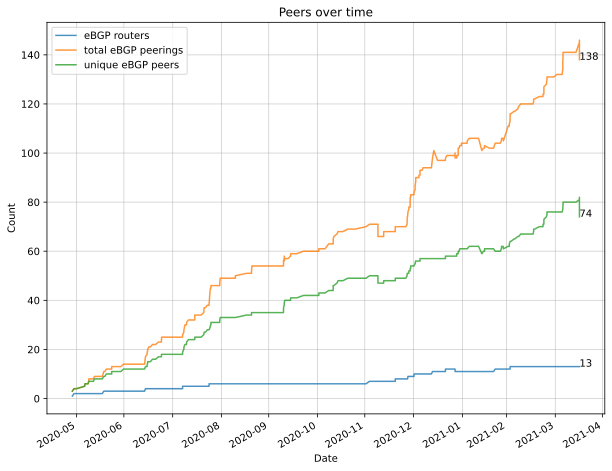

# ansible-dn42

This repository contains the configs for **AS4242421080 / HIGHDEF-AS** on [dn42](https://dn42.dev/Home). For more details, see https://highdef.network/

## Network topology

This iteration of the network uses OSPF (v2 + v3) and a full mesh of iBGP sessions over WireGuard. Internal costs between nodes are [periodically generated](scripts/igpping/) based off latency and packet loss.

[Routing Policy](ROUTING-POLICY.md)

## Config structure

Here I use Ansible to configure the following components on Debian 11 hosts:

- Wireguard ([roles/config-wireguard/](roles/config-wireguard/)) via ifupdown
- OpenVPN 2.5
- BIRD 2 ([roles/config-bird2/](roles/config-bird2/))
- [bird-lg-go](https://github.com/xddxdd/bird-lg-go) looking glass
- nginx + Let's Encrypt (certbot): frontend reverse proxy to bird-lg, Netdata, and a custom splash site
- [dn42 Peerfinder](https://dn42.us/peers) (cron job)
- Anycast DNS via PowerDNS:
  - Authoritative server for highdef.dn42 and PTR zones
  - Public recursive resolver (dn42, clearnet, and interconnected networks) @ **dns.highdef.dn42** / 172.23.0.53 / fd42:d42:d42:53::1
  - For this I also use a [custom DNS zone generator](scripts/make-dns-zones.py) that reads from [YAML](global-config/dns-entries.yml) and the Ansible inventory
- iptables firewall rules for dn42
- [Netdata](https://www.netdata.cloud/) (monitoring stack) with [bird_exporter](https://github.com/czerwonk/bird_exporter)
- Smokeping

Some components (Bird backports, etc.) pull from my personal APT repository @ https://deb.utopia-repository.org/

## Network history

